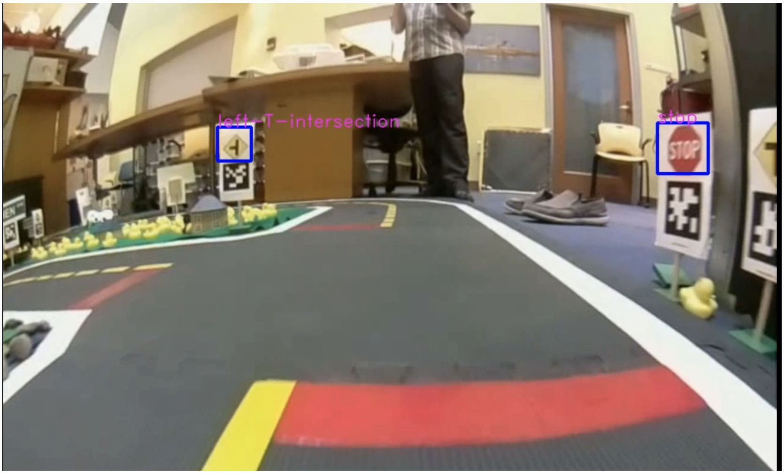
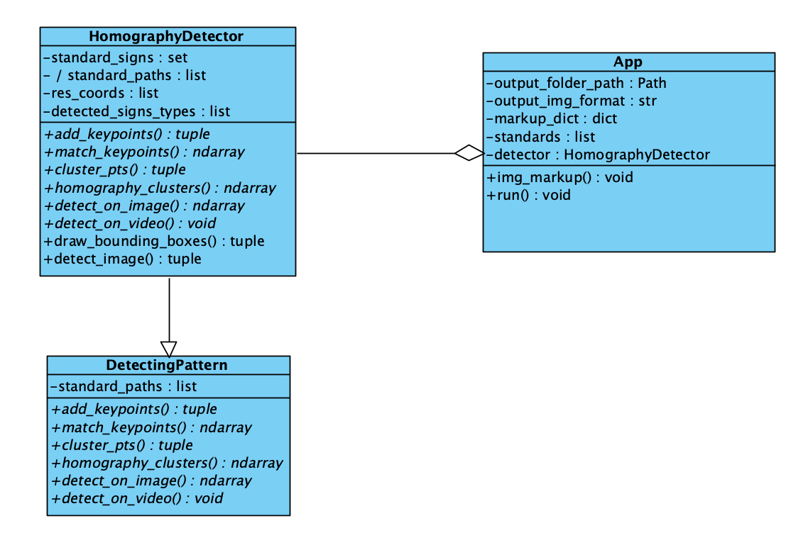

# Road signs markup-er

Консольная утилита, предназначенная для создания датасета для детекции дорожных знаков.

### Мотивация:

Беспилотный транспорт с каждым годом стремительно развивается вместе с развитием индустрией компьюютерного зрения. Для обучения свёрточных нейронных сетей требуются большие объёмы размеченных данных. Данное консольное приложение может помочь быстро и автоматически разметить данные.

### Как использовать?

После запуска скрипта на экран будут выводиться изображения, поданные на вход скрипту, с обведёнными в прямоугольник дорожными знаками и подписями их типа. Если выведенное изображение устраивает пользователя, то нажатием на клавишу “пробел” изображение сохраняется в соответствующую папку. Если же изображение не устраивает, то его можно пропустить, нажав на любую клавишу (кроме “пробела”).

### Как запустить?

1. Установка зависимостей: `pip install -r requirements.txt`;
2. Запуск:  `python main.py video.mp4`.

##### Обязательные аргументы:

- название видео/изображения, которое требуется разметить (`video.mp4`).

##### Дополнительные аргументы:

- `-p` , `--signs_path` — путь к папке с изображениями знаков, default: `signs`;
- `-o`, `--output_path` — путь к папке с результатом работы скрипта, defalut: `output`;
- `-s`, `--skip` — количество кадров в видео, пропущенных на каждой итерации, default: `24`;
- `-ss`, `--skip_start` — количество кадров, пропущенных с начала видео, default=`0`;
- `-sl`, `--skip_last` — количество кадров, пропущенных с конца видео, default=`0`;
- `-f`, `--img_format` — формат результирующих изображений, default=`png`.

### Архитектура

 
